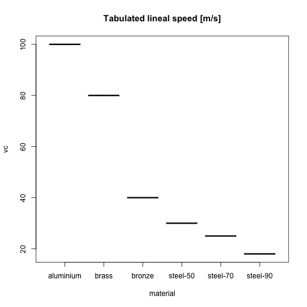

## Introduction 

Recently I am teaching Machining in a vocational school and I have decided to do a small app useful for my lessons.

## Case of study

We are interested in doing a hole in a metal with a bit made of HSS steel.

### Machining: Drill speed

We know that the drill has an option to choose the speed, usually in $rpm$

### How fast can the bit work? 

There is a parameter call linear speed $ v_{c}$ that indicates the proper speed to hole each material.

--- .class #id 

This linear speed is tabulated. The materials and values used are:

 

--- .class #id 

## Calculations

If the hole has a diameter $\phi$ the speed in the drill has to be calculated:

$$n=\frac{v_{c}·1000}{\pi·\phi}$$

### This is what our shinyapp is doing!! 
[Clic to visit our app](https://irocho.shinyapps.io/drill/ "Electronic drill")

## How to use it

On the sidebar:

* the metal in which the hole is made.
* the diameter of the hole is selected 

On the main panel the drill speed is obtained

--- &radio

Just a question as a first test for students to answer:

## Question 1

The material our bits are made is...

1. brass
2. _HSS steel_
3. aluminium
4. wood

*** .hint
It should be hard enough

*** .explanation
HSS steel is very hard and a conventional material to make industrial bits

